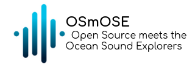

  
  

# OSmOSE Project on Datarmor

The Open Science meets Ocean Sound Explorers is a collaborative research project aiming to develop a complete collection of FAIR acoustic analysis tools and methods. 

## Presentation

Our [OSmOSE toolkit](https://github.com/Project-OSmOSE/osmose-toolkit) has been deployed on the [DATARMOR](https://www.ifremer.fr/fr/infrastructures-de-recherche/le-supercalculateur-datarmor) cluster of IFREMER, on which our production version runs. The toolkit is available to Datarmor members (must be affiliated to unix group gosmose, you will need a user account that may be provided upon request to be sent at dorian.cazau@ensta-bretagne.fr) as a suite of notebooks available in `/home/datawork-osmose/osmose-datarmor/notebooks/` and covering the most basic processing cases:

1. data_uploader.ipynb : used for the importation and formatting of new datasets;

2. spectrogram_generator.ipynb : used for the generation of file-scale (or shorter) spectrograms;

3. soundscape_analyzer.ipynb : used for long-term analysis (i.e. with timescale at least longer than the audio file duration), including the computation of soundscape metrics (eg long-term averaged spectrograms, EPD) and the retrieval of raw welch spectra at different time resolutions;

See our [user guide](assests/user_guide.pdf) for more details.

## Quick start for users

The newest stable version of the toolkit can be directly used within a Jupyter Hub session of Datarmor by setting the kernel to `osmose`. 

## Quick start for developers

To develop and/or test some code contributions to our toolkit on Datarmor, please refer to the `Contribution on Datarmor` section of [README](https://github.com/Project-OSmOSE/osmose-toolkit/edit/develop/README.md). Beyond the codes inherent to the toolkit described in this section, the folder `/home/datawork-osmose/osmose-datarmor/source/` contains source codes specific to Datarmor such as pbs job submission.

## License

This program is free software: you can redistribute it and/or modify it under the terms of the GNU Affero General Public License as published by the Free Software Foundation, either version 3 of the License, or (at your option) any later version. See [LICENSE](LICENSE) for the complete AGPL license

